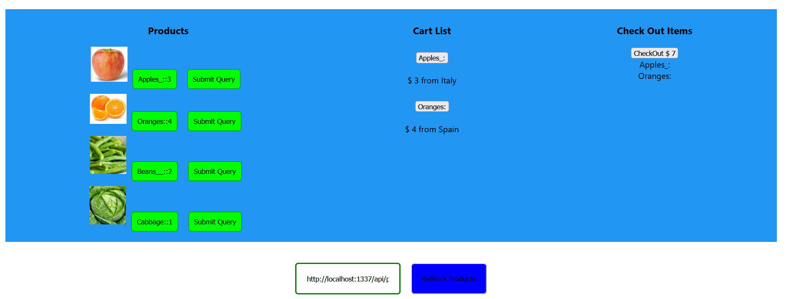

# 1. Project Title: Shopping cart: Integrate Strapi with a React application
   This application updates shopping cart items by pulling products from inventory/backend strapi database.
   
     1.fkr-shopping-car
# 2. Motivation
    Learning how to integrate front end app with backend api
# 3. Build Status
     Work in progress
# 4. Code Style
    react JSX, CSS, Javascript, HTML
# 5. Tech/Framework used
    React, HTML, CSS, JavaScript
# 6. Installation
     will update
# 7. API References
     will update
# 8. Tests
# 9. How to Use
    will update
# 10. Contribute
    will update
# 11. License
  GitHub, MIT and others technology owners’ products/services/logs are their own.
